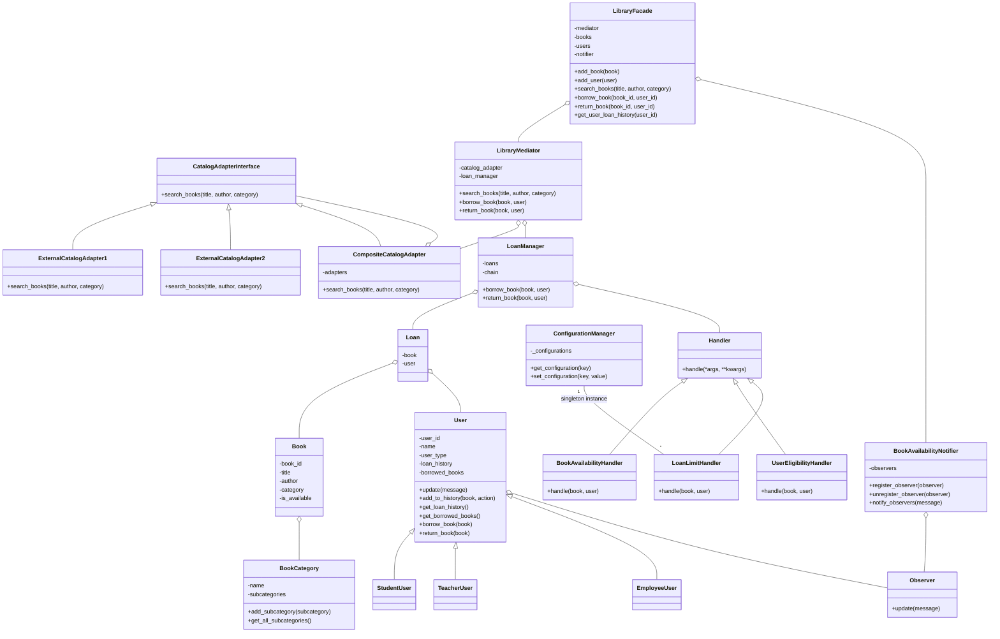

- [Sistema de Biblioteca](#sistema-de-biblioteca)
  - [Estrutura do Projeto](#estrutura-do-projeto)
  - [Descrição das Classes](#descrição-das-classes)
  - [Instruções de Uso](#instruções-de-uso)
    - [Pré-requisitos](#pré-requisitos)
    - [Instalação](#instalação)
    - [Executando o Projeto](#executando-o-projeto)
  - [Funcionalidades](#funcionalidades)
  - [Exemplo de Uso](#exemplo-de-uso)
  - [Diagrama UML](#diagrama-uml)
  - [Contato](#contato)

# Sistema de Biblioteca
Este projeto é um sistema de biblioteca implementado em Python que utiliza diversos padrões de design para facilitar a busca, empréstimo e devolução de livros, além de gerenciar categorias de livros, usuários, e notificações.

## Estrutura do Projeto
A estrutura do projeto está organizada em pastas conforme abaixo:

```
librarySystem/
│
├── adapters/
│   ├── catalog_adapter_interface.py
│   ├── external_catalog_adapter_1.py
│   ├── external_catalog_adapter_2.py
│   └── composite_catalog_adapter.py
│
├── core/
│   ├── library_mediator.py
│   ├── library_facade.py
│   ├── book_category.py
│   ├── book.py
│   ├── observer.py
│   ├── user.py
│   ├── loan.py
│   ├── loan_manager.py
│   ├── configuration_manager.py
│   └── book_availability_notifier.py
│
├── handlers/
│   ├── handler.py
│   ├── book_availability_handler.py
│   └── user_eligibility_handler.py
│   └── loan_limit_handler.py
│
└── main.py
```

## Descrição das Classes
|\#|	Nome da Classe	|Resumo do que a Classe Faz|
|---|---|---|
|1	|CatalogAdapterInterface	|Interface abstrata para busca de livros em catálogos externos|
|2|	ExternalCatalogAdapter1| 	Adapter para buscar livros em um catálogo externo específico|
|3|	ExternalCatalogAdapter2| 	Adapter para buscar livros em outro catálogo externo específico|
|4|	CompositeCatalogAdapter| 	Combina resultados de múltiplos adapters de catálogos externos|
|5|	LibraryMediator| 	Coordena interações de busca, empréstimo e devolução de livros|
|6|	LibraryFacade| 	Fornece uma interface simplificada para operações de biblioteca|
|7|	BookCategory| 	Gerencia categorias de livros de forma hierárquica|
|8|	Book| 	Representa um livro, com atributos como título, autor e disponibilidade|
|9|	Observer| 	Interface abstrata para o padrão Observer|
|10|	User| 	Usuário da biblioteca que recebe notificações (Observer)|
|11|	StudentUser| 	Subclasse de User representando um estudante|
|12|	TeacherUser| 	Subclasse de User representando um professor|
|13|	EmployeeUser| 	Subclasse de User representando um funcionário|
|14|	Loan| 	Representa um empréstimo de livro|
|15|	LoanManager| 	Gerencia empréstimos e devoluções de livros|
|16|	ConfigurationManager| 	Gerencia configurações globais do sistema|
|17|	BookAvailabilityNotifier| 	Notifica usuários sobre mudanças no status dos livros|
|18|	Handler| 	Classe base abstrata para implementar a cadeia de responsabilidade|
|19|	BookAvailabilityHandler| 	Verifica se o livro está disponível para empréstimo|
|20|	UserEligibilityHandler| 	Verifica se o usuário é elegível para realizar empréstimos|
|21|	LoanLimitHandler| 	Verifica se o usuário não ultrapassou seu limite de empréstimos|
|22|	main| 	Configura o sistema de biblioteca e realiza operações de exemplo|

## Instruções de Uso

### Pré-requisitos
Certifique-se de ter o Python 3.x instalado em sua máquina.

### Instalação
Clone o repositório para sua máquina local:

```bash
git clone https://github.com/Leonardo-Costa/library-oop.git
cd library-oop
```

### Executando o Projeto
Para começar a usar o sistema de biblioteca, execute o script main.py:

```
python main.py
```

### Usando o `library_cli.py`
O library_cli.py fornece uma interface de linha de comando interativa para interagir com o sistema de biblioteca. Você pode executar o CLI com o seguinte comando:

```
python library_cli.py
```

## Funcionalidades

O sistema de biblioteca oferece as seguintes funcionalidades principais:

1. Buscar Livros: Pesquisa livros disponíveis no sistema por título, autor ou categoria.
2. Emprestar Livros: Permite que usuários qualificados emprestem livros disponíveis.
3. Devolver Livros: Permite que usuários devolvam livros que emprestaram.
4. Consultar Histórico de Empréstimos: Consulta o histórico de empréstimos de um usuário específico.
5. Atualizar Limites de Empréstimos: Define novos limites de empréstimos para diferentes papéis de usuários.
6. Adicionar Livros: Adiciona novos livros ao catálogo da biblioteca.
7. Limpar Tela: Limpa a tela do terminal para uma melhor visualização.
8. Sair do CLI: Encerra a sessão do CLI.

## Exemplo de utilização da CLI
```bash
(biblioteca) search_by_title Python Programming
Livros encontrados com o título 'Python Programming':
Book ID: 1, Title: Python Programming, Author: John Doe, Category: Programming

(biblioteca) borrow_book 1 1
Empréstimo realizado com sucesso!

(biblioteca) get_user_loan_history 1
Histórico de empréstimos do usuário 1:
Livro: Python Programming, Ação: Emprestado

(biblioteca) set_loan_limit Student 5
Novo limite de empréstimos para estudantes: 5

(biblioteca) add_book 6 "Advanced Java" "James Gosling" "Programming"
Livro 'Advanced Java' adicionado com sucesso.

(biblioteca) return_book 1 1
Devolução realizada com sucesso!

(biblioteca) clear
```

## Diagrama UML



Contato
Leonardo Loureiro Costa - leonardo.costa@unifesp.br
Rafael Yan da Silva - rafael.yan@unifesp.br

Link do Projeto: https://github.com/Leonardo-Costa/library-oop
